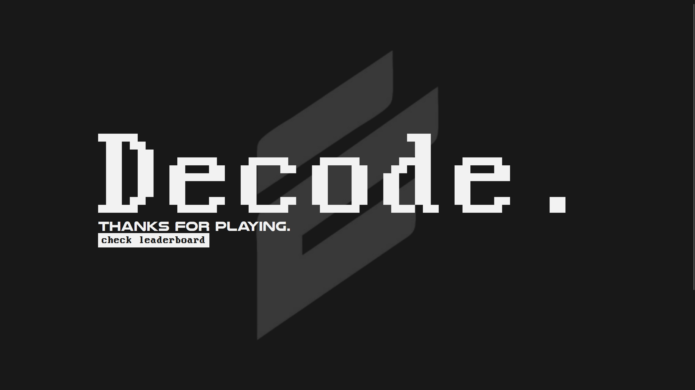
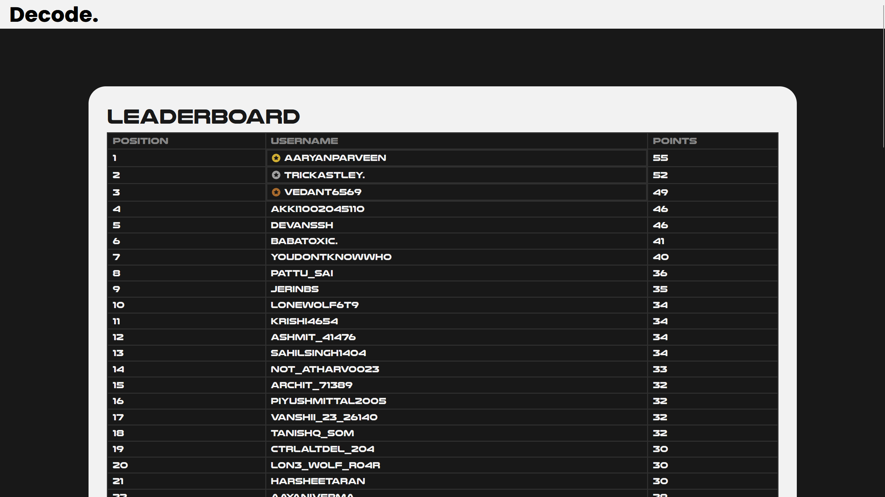

# Decode 4.0 Leaderboard
The code hosted via GitHub pages for the domain [acm-decode.xyz](https://acm-decode.xyz) since the event is over and it doesn't make sense to have the DigitalOcean server running just for leaderboard.

**NOTE:** The entire codebase for decode could be found [here](https://github.com/krishsharma0413/decode4.0)

## Screenshots
`index.html`

`leaderboard.html`

## Credits
Thank you for everyone who took part in this event. It was a fun experience.